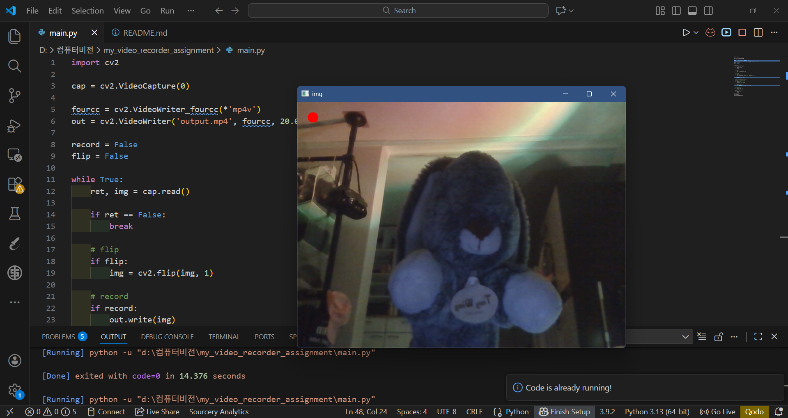

# Video Recorder Project

## 소개

컴퓨터 비전 수업 과제로 만든 간단한 비디오 녹화 프로그램입니다.
웹캠으로 화면을 띄우고 키보드로 녹화, 캡처, 화면 반전 기능을 사용할 수 있습니다.

---

## 기능

- 스페이스바 누르면 녹화 시작 / 다시 누르면 중지
- c 키 누르면 현재 화면 캡처
- esc 누르면 프로그램 종료

---

## 추가 기능

- f 키를 누르면 화면이 좌우 반전됩니다.

---

## 사용 방법

1. 프로그램 실행
2. 웹캠 화면 확인
3. 스페이스바 → 녹화 시작/중지
4. c → 캡처
5. f → 화면 반전
6. esc → 종료

---

## 파일 설명

- output.avi : 녹화된 영상 파일
- screenshot.jpg : 캡처 이미지 파일

---

## 실행 화면

두 번째 스크린샷에서는 'f' 키를 눌러 좌우 반전 기능을 적용한 화면을 확인할 수 있습니다.

---

## 실행 영상

[영상 보기](output.mp4)

---

## 느낀 점

OpenCV를 처음 써봐서 처음에는 조금 헷갈렸는데
직접 해보니까 기본적인 동작은 이해할 수 있었습니다.
키 입력으로 기능을 제어하는 부분이 조금 어려웠습니다.
